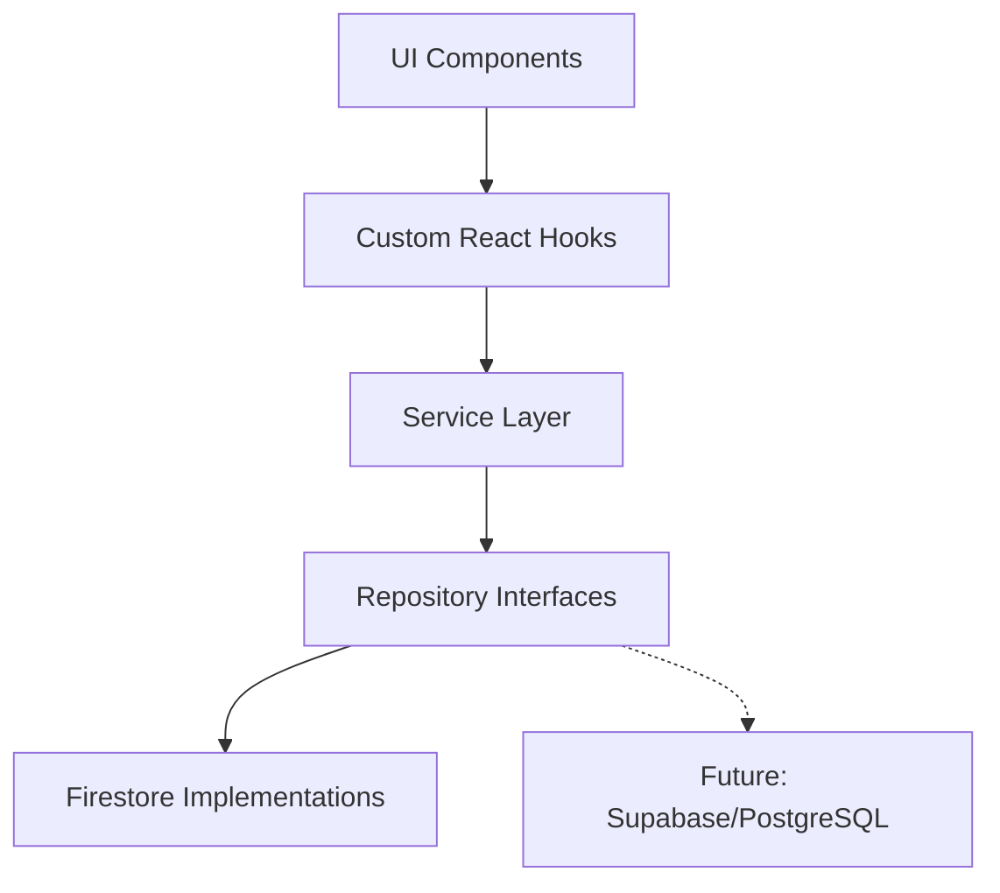

# Implementation Plan - ChullSheet SaaS Transformation (Finalized)

This implementation plan details the transformation of ChullSheet from a collaborative document application into a complete productivity platform similar to Notion.

---

## Finalized Design Decisions

> [!IMPORTANT]
> **1. Authentication Middleware**
> - Create [middleware.ts](file:///d:/$inghamImpFile/projectshyam/chullsheet/middleware.ts) using Clerk middleware.
> - Protect `/dashboard`, `/doc/**`, `/habits/**`, `/job-tracker/**`, `/todo/**`.
> - Keep landing page `/`, `/products/**`, `/solutions/**`, `/resources/**`, and `/developers` completely public.

> [!IMPORTANT]
> **2. Team Todo Database Schema**
> - Dedicated root collection `teams/{teamId}` containing:
>   - `name`, `description`, `ownerId`, `ownerEmail`, `members` (array of user emails/IDs), `admins` (array of user emails/IDs), `createdAt`, `updatedAt`.
> - Subcollections:
>   - `teams/{teamId}/todos/{todoId}`: tasks.
>   - `teams/{teamId}/comments/{commentId}`: todo comments.
>   - `teams/{teamId}/activities/{activityId}`: activity feed logs.
> - User membership tracking:
>   - `users/{userId}/teamMemberships/{teamId}`: document containing status/roles for quick authorization queries.
> - Real-time updates handled using Firestore `onSnapshot` subscriptions.

> [!IMPORTANT]
> **3. Habit Contribution Heatmap**
> - Displays a GitHub-style contribution grid for the past 365 days.
> - Calculates total completed habits per day from the user's `habitEntries` subcollection.
> - Interactive features: hover tooltips showing date & completion count, real-time updates, and click-to-navigate.

---

## Proposed Changes

We will introduce a Repository Pattern to abstract database operations (Firestore). This decouples our UI components from the database layer, allowing future migrations to Supabase or PostgreSQL without modifying the UI layer.

### 1. Route Grouping & Layout Migration

#### [MODIFY] [app/layout.tsx](file:///d:/$inghamImpFile/projectshyam/chullsheet/app/layout.tsx)
Remove `<Header />` and `<Sidebar />` from the Root Layout. It will now only set up Clerk, global fonts, the Toast notifications container, and pass `{children}` directly.

#### [MODIFY] [app/page.tsx](file:///d:/$inghamImpFile/projectshyam/chullsheet/app/page.tsx)
Root page file:
- Check Clerk authentication on server-side.
- If authenticated: Redirect to `/dashboard`.
- If not authenticated: Render the premium SaaS Landing Page.

#### [NEW] [middleware.ts](file:///d:/$inghamImpFile/projectshyam/chullsheet/middleware.ts)
Implement Clerk route protection.

#### [NEW] [app/(public)/layout.tsx](file:///d:/$inghamImpFile/projectshyam/chullsheet/app/(public)/layout.tsx)
Layout for public routes. Contains the dark-themed SaaS Navbar (Dropdowns for Products, Solutions, Resources; Links to Developers and Clerk buttons) and the global SaaS Footer.

#### [NEW] [app/(workspace)/layout.tsx](file:///d:/$inghamImpFile/projectshyam/chullsheet/app/(workspace)/layout.tsx)
Layout for authenticated pages. Contains the redesigned Workspace shell:
- Left-side collapsible sidebar.
- Top fixed header (hamburger menu, breadcrumbs, user button).
- Scrollable content area.

#### [NEW] [app/(workspace)/dashboard/page.tsx](file:///d:/$inghamImpFile/projectshyam/chullsheet/app/(workspace)/dashboard/page.tsx)
The landing point for logged-in users, displaying the default workspace view (e.g. "Get started with creating a New Document").

#### [NEW] [app/(public)/products/docs/page.tsx](file:///d:/$inghamImpFile/projectshyam/chullsheet/app/(public)/products/docs/page.tsx) (and other products/solutions/resources/developers routes)
Premium informational pages explaining features, value, and usage, with high-quality visual mockups.

---

### 2. Database Architecture & Service Layer
We will create a clean Repository pattern in `lib/repositories` to manage all read/write operations.

#### [NEW] [interfaces.ts](file:///d:/$inghamImpFile/projectshyam/chullsheet/lib/repositories/interfaces.ts)
Defines Type definitions and Repository interfaces for habits, jobs, and todos.

#### [NEW] [firestoreRepository.ts](file:///d:/$inghamImpFile/projectshyam/chullsheet/lib/repositories/firestoreRepository.ts)
Implements all repository interfaces using Firestore. Uses `db` from [firebase.ts](file:///d:/$inghamImpFile/projectshyam/chullsheet/firebase.ts).

#### [NEW] [useHabits.ts](file:///d:/$inghamImpFile/projectshyam/chullsheet/lib/hooks/useHabits.ts)
Custom hook that subscribes to Firestore real-time updates for habits and daily entries.

#### [NEW] [useJobTracker.ts](file:///d:/$inghamImpFile/projectshyam/chullsheet/lib/hooks/useJobTracker.ts)
Custom hook for Kanban board state and application editing/filtering.

#### [NEW] [useTodos.ts](file:///d:/$inghamImpFile/projectshyam/chullsheet/lib/hooks/useTodos.ts)
Custom hook for personal/team todos, comments, activity log, and notifications.

---

### 3. Habit Tracker Module

#### [NEW] [app/(workspace)/habits/page.tsx](file:///d:/$inghamImpFile/projectshyam/chullsheet/app/(workspace)/habits/page.tsx)
Renders the monthly spreadsheet grid, navigation, heatmap header, and summary stats.

#### [NEW] [components/habits/HabitCalendar.tsx](file:///d:/$inghamImpFile/projectshyam/chullsheet/components/habits/HabitCalendar.tsx)
Grid renderer with dates, weekdays, habit rows, and custom scroll container.

#### [NEW] [components/habits/HabitRow.tsx](file:///d:/$inghamImpFile/projectshyam/chullsheet/components/habits/HabitRow.tsx)
Individual habit row displaying name, reorder handle, interactive cells for each day, and calculated streak stats.

#### [NEW] [components/habits/HabitCell.tsx](file:///d:/$inghamImpFile/projectshyam/chullsheet/components/habits/HabitCell.tsx)
Cell displaying status color. Cycles through `Not Marked` → `Completed` → `Skipped` → `Missed` on click.

---

### 4. Job Application Tracker Module

#### [NEW] [app/(workspace)/job-tracker/page.tsx](file:///d:/$inghamImpFile/projectshyam/chullsheet/app/(workspace)/job-tracker/page.tsx)
Kanban stage board and applications list dashboard.

#### [NEW] [app/(workspace)/job-tracker/[applicationId]/page.tsx](file:///d:/$inghamImpFile/projectshyam/chullsheet/app/(workspace)/job-tracker/%5BapplicationId%5D/page.tsx)
Notion-like details page for an application. Dynamic Q&A editor, status dropdown, auto-saving.

#### [NEW] [components/job-tracker/StageBoard.tsx](file:///d:/$inghamImpFile/projectshyam/chullsheet/components/job-tracker/StageBoard.tsx)
Kanban board component allowing drag-and-drop of cards across columns.

---

### 5. Todo Module

#### [NEW] [app/(workspace)/todo/page.tsx](file:///d:/$inghamImpFile/projectshyam/chullsheet/app/(workspace)/todo/page.tsx)
Split navigation between Personal Todo and Team Todo.

#### [NEW] [components/todo/PersonalTodoView.tsx](file:///d:/$inghamImpFile/projectshyam/chullsheet/components/todo/PersonalTodoView.tsx)
Personal tasks view (List, Kanban Board, Calendar views) with filters.

#### [NEW] [components/todo/TeamTodoView.tsx](file:///d:/$inghamImpFile/projectshyam/chullsheet/components/todo/TeamTodoView.tsx)
Collaborative board supporting multiple teams, email invitations, activities feed, and real-time task assigning.

---

## Verification Plan

### Automated Tests
Verify correctness via:
- `npm run lint`: Verify typescript and config rules.
- `next build`: Ensure Next.js builds cleanly.

### Manual Verification
- Log out to verify premium SaaS landing page, public dropdowns, and responsive navbar.
- Log in to verify redirects, workspace layout, collapsed states, and mobile drawers.
- Test real-time synchronization of Habits, Job Applications, and Todos on multiple browser sessions.
